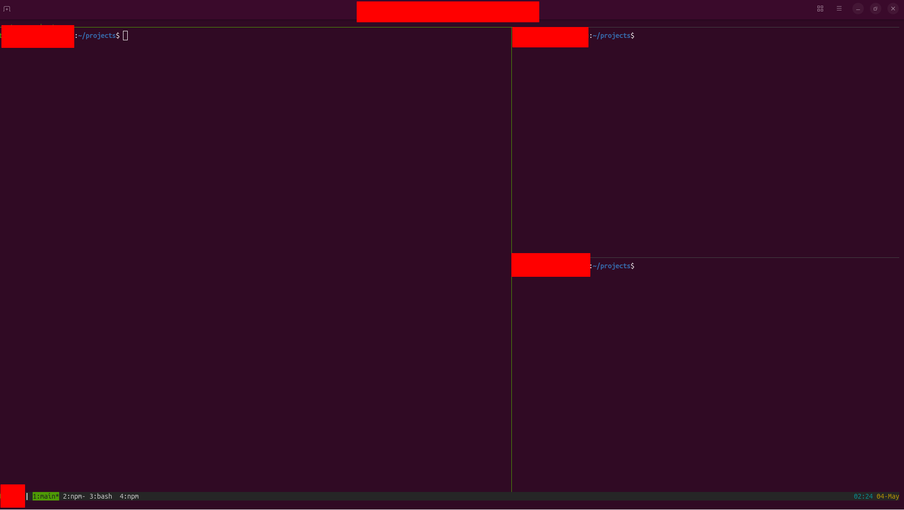

# 🚀 Dev-Workflow

Modern terminal-based development environment with **Vim + Tmux + Git integration**.  
Designed for developers who want a fast, keyboard-driven workflow with a beautiful layout.



## ✨ Features

- 🎨 **Beautiful 3-pane layout**: Vim editor (left) + Claude Code (top-right) + Terminal (bottom-right)
- 📊 **Real-time Git diff** in Vim (additions, modifications, deletions in the gutter)
- 🔥 **Vim-Fugitive integration**: `:Git`, `:Gdiff`, `:Gblame` directly in Vim
- 🚀 **One-command project launcher**: `proj` opens the layout for any directory
- 🔍 **FZF project switcher**: `projs` to fuzzy-find and switch projects
- ⚡ **Optimized Vim config** with 12+ essential plugins
- 🎯 **Sensible tmux defaults** (Ctrl+a prefix, Vim-style navigation)
- 📦 **One-script installation**

## 📋 Requirements

- Linux (tested on Ubuntu 24.04+ and 26.04)
- bash shell
- Internet connection (for installing packages and plugins)
- Optional: [Claude Code](https://docs.anthropic.com/claude-code) for AI pair programming

## 🛠 Installation

```bash
# Clone the repo
git clone https://github.com/YOUR_USERNAME/dev-workflow.git
cd dev-workflow

# Run installer
./install.sh
```

The installer will:
1. Backup your existing configs to `~/.dev-workflow-backup-{timestamp}/`
2. Install required system packages (tmux, vim, fzf, ripgrep, xclip)
3. Place config files in your home directory
4. Install Vim plugins (vim-plug + 12 plugins)
5. Set up `proj` and `projs` commands

After installation, restart your terminal or run:

```bash
source ~/.bashrc
```

## 🚀 Usage

### Launch a project layout

```bash
cd ~/projects/your-project
proj    # or: p
```

This opens a tmux session with:
- **Left (70%)**: Vim with file explorer
- **Top-right (15%)**: Claude Code (if installed)
- **Bottom-right (15%)**: Terminal with `git status`

### Switch between projects

```bash
projs   # or: ps
```

Opens an FZF picker showing:
- `[ACTIVE]` — currently running tmux sessions
- `[NEW]` — projects in `~/projects/` available to launch

### Useful Aliases

| Alias | Command |
|-------|---------|
| `p` | `proj` |
| `ps` | `projs` |
| `tls` | `tmux ls` |
| `ta` | `tmux attach -t` |
| `tk` | `tmux kill-session -t` |
| `gs` | `git status` |
| `gd` | `git diff` |
| `gl` | `git log --oneline --graph` |

## ⌨️ Key Bindings

### Tmux (prefix: `Ctrl+a`)

| Keys | Action |
|------|--------|
| `Ctrl+a \|` | Split vertical |
| `Ctrl+a -` | Split horizontal |
| `Ctrl+a h/j/k/l` | Navigate panes (Vim-style) |
| `Ctrl+a H/J/K/L` | Resize panes |
| `Ctrl+a z` | Toggle pane zoom |
| `Ctrl+a d` | Detach session |
| `Ctrl+a r` | Reload config |

### Vim (leader: `Space`)

#### Git (vim-gitgutter + fugitive)

| Keys | Action |
|------|--------|
| `]c` / `[c` | Next/prev git hunk |
| `<Space>gn` / `<Space>gp` | Next/prev hunk |
| `<Space>gh` | Preview hunk diff |
| `<Space>gs` | Stage hunk |
| `<Space>gu` | Undo hunk |
| `<Space>gd` | Open Git diff split |
| `<Space>gb` | Git blame |
| `<Space>gg` | Open Git status |

#### File Navigation

| Keys | Action |
|------|--------|
| `<Space>e` | Toggle file explorer (NERDTree) |
| `<Space>f` | Find current file in explorer |
| `<Space>p` | Fuzzy find files (FZF) |
| `<Space>b` | List buffers |
| `<Space>r` | Search in files (ripgrep) |

## 🎨 Customization

See [docs/customization.md](docs/customization.md) for:
- Changing pane sizes
- Adding new plugins
- Modifying color schemes
- Adding custom aliases

## 🔧 Troubleshooting

See [docs/troubleshooting.md](docs/troubleshooting.md) for common issues.

## 🗑 Uninstall

```bash
./uninstall.sh
```

Backs up configs to `~/.dev-workflow-uninstall-backup-{timestamp}/`.

## 📜 License

MIT — feel free to fork and customize.

## 🙏 Credits

Built with these excellent tools:
- [tmux](https://github.com/tmux/tmux)
- [Vim](https://www.vim.org/) + [vim-plug](https://github.com/junegunn/vim-plug)
- [vim-gitgutter](https://github.com/airblade/vim-gitgutter)
- [vim-fugitive](https://github.com/tpope/vim-fugitive)
- [fzf](https://github.com/junegunn/fzf)
- [NERDTree](https://github.com/preservim/nerdtree)
